# Analyzing the Leading Causes of Death in United States
#### By Pratyush Painuly, Mohammad Shiwani and Brandon Valmont

## Aim
To investigate the distribution of death in United States and form insight at a macro(global) and micro level(statewide).

## About - 
CDC released mortality data for each death occured in United States annually, under the National Vital Statistics Systems. This mortality dataset gives insight into every death in the country, including the cause of death, location(State), time and scientific description of the respective cause. Data.cdc.gov takes that data to present the age-adjusted death rates for the 10 leading causes of death in the United States beginning in 1999, which we will be analysing for this project. Our goal is to look into the pattern of death distribution across the country/states and explore the complex circumstances which dominate this dataset, hence get a better understanding of leading causes in the country. We also aim to look at this data with a global outlook and analysis of how the mortality rates of countries with similar size, per capita and GDP match with United States. At a more micro level and local level, the group want to understand what the leading causes of death are in Texas and what the trends over time are for the leading causes in Texas. The group also aims to investigate what could impact those age adjuste death rate trends.  

## Dataset Overview
The [main dataset](https://data.cdc.gov/NCHS/NCHS-Leading-Causes-of-Death-United-States/bi63-dtpu) was obtained in .csv format from Data.CDC.gov under the publisher National Center for Health Statistics. The information in the dataset compiles the death certificates filed in each state and presents it as a summary for each year by state and cause of death. Age-adjusted death rates (per 100,000 population) are based on the 2000 U.S. standard population. The source dataset has 10,296 rows and 6 columns (Year, 113-Cause,Cause Name,State, Deaths and Age Adjusted Deaths). We downloaded the dataset directly from the website and imported as a dataframe in jupyter notebook before beginning our analysis. The data for unemployment rates in TX, CA, and NY came form Fred (https://fred.stlouisfed.org/series/TXUR) in the form of a .csv file.  

## Questions regarding the Dataset - 
We discussed in details various ways to approach the dataset. We divided our approach into sections, each one aiming to look at the data in a different perspective. 

### Section 1 - Causes of Death, Nation Wide/Global Insights
We looked at the dataset in a general countrywise view. We looked at what have been the leading causes throughout the timeframe and how have they changed. How can we look at the same questions for each state. Now, how does the number of deaths compare with the rest of the world? Espcially to "similar" countries with respect to size, GDP and wealth(or poverty). How does United States rank with other countries in mortality rate and what is the progression of time?

### Section 2 - Leading Causes of Death in United States
The initial data from CDC was clean data. All we had to do was filter the data for any state we need. This data includes number of death's in each state nationwide for 11 different causes. Out of 11 causes 10 are specified. Looking at the data first question that came to our mind was what are the leading causes of death in US. All 10 Causes of death were observed. To observe the trends for a particular state feel free to run the code and enter the state you would like the data for when asked and it will display you how these leading causes of death are trending.

When the team looked at the number of deaths in United Sates for each cause we discovered that Heart disease and Cancer are top two causes of death in the nation but over time the pecent of death due to these diseases is going down. Going through the rest of the causes of death we noticed an upward trend in Sucide and Alzheimer's disease.

### Section 3 - Leading Causes of Death in Texas  
The original data was taken from the CDC included all states and the District of Columbia.  In this section of the project, the group wanted to answer what the leading causes of death were on a micro level.  The discision was made to analyze Texas since that state would satisfy slicing the data to a micro level and would also be the state local to Rice University.  After drilling down into the original dataset and filtering for Texas, it was determined that heart disease, cancer, and stroke were the three leading causes of death respectively.  

### Leading Causes' Trends 
After determing heart disease, cancer, and stroke were the top 3 leading causes of death in Texas respectively, the next question to answer was how does the age adjusted death rates for these leading causes of death trend over time relative to the data set that was available from the CDC (1999-2000).  Overall, it was found that the age adjusted death rates for heart disease, cancer, and stroke were decreasing starting from 1999.  However, 2015 saw the age adjusted death rate tick up for heart disease and stroke while the age adjusted death rate for cancer held steady but did not decline.  

## Analysis

### Mortality Rate - From a Nationwide and Global Perspective

We looked at the distribution for Causes of Death around the Country, per state and tried to paint a picture how each state relates with its Leading Cause, and how dominant is that Leading Cause for that respective state. The deaths measured and plotted here is the AGe Adjusted Death i.e Number of deaths per 100,000 people. This is done to make sure the data analysed and visualized is normalized and not biased.

  * Total Deaths per State Around United States- 
  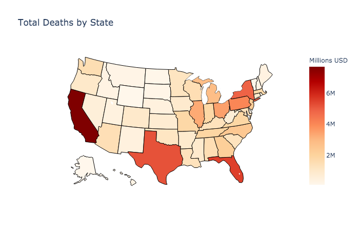
  
The graph shows a darker shade of red for more deaths. As we can expect, the states with a higher population density have more deaths. New York, Texas and California show the largest Deaths. These three states account for 5 of the top 10 largest cities in the country(New York, LA, Houston, San Antonio and Dallas). So we expect more deaths per 100000 jut due to the large proportion of popullation occupied by these three states. About 80% of all states have Heart Disease as the leading Cause. 

  * Proportion of Leading Cause of Death for each State- 
  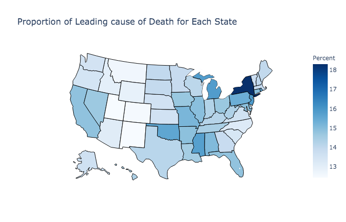
  
Heart Disease accounts for 18.31% of all deaths in the State of New York for the entire time period of the dataset. The second highest proportion is New jersey at 15.9% followed by Michigan at 15.83%. Its interesting that the the three highest proportions are all from North-Eastern region and close to each other. Heart diseases is the leading cause for 41 of 50 States. 18 out of 20 largest cities economically have Heart Disease as the leading Cause(Seattle and Denver have Cancer as the leading cause). What does that tell us about work life Balance in these economic powerhouses?

California and Texas both have Heart Disease as the Leading Cause of Death at 14.84% and 14.3% respectively.

Cancer accounts for 9 of 50 states analysed. These states are Alaska, Colorado, Maine, Massuchettes, Minnesota, New Hampshire, Oregon, Vermont and Washington. New Mexico has the lowest proportion with Heart Disease accounting for 60798 death among 489205 total deaths with a mortality rate of 12.43%.

  * Mortality Rate United States and Similar Countries- 

The [Organisation for Economic Co-operation and Development (OECD)](https://www.oecd-ilibrary.org/social-issues-migration-health/data/oecd-health-statistics_health-data-en) is a group of 34 member countries that discuss and develop economic and social policy. OECD members are democratic countries that support free market economies. They combines a set of countries as being "similar" based on their size, wealth, per capita GDP and socio-economic reforms. Based on that index, we compiled the data set for countries similar to US which are - Austria,	Belgium, France, Japan, Netherlands, Sweden, Switzerland, United Kingdom, Germany, Canada and Australia. The dataset was further cleaned up and Australia, Germany and Canada were removed. We then compiled the "Comparable Country Average" which would account for the 7 countries together. We wanted to look into how the Mortality Rate of the US compares with the Average Comparable Rate from Similar countries.

 

From the chart above, Mortality Rate in the US over took the Averate trend around 1985. Could it the introduction of corn syrup, or the influx of HIV, of just population migration into United States post World War and during the Cold War time period. Those are some of the questions that the chart opens up for further discussion and research. The United States has led the mortality rate since then and has a higher rate when compared to all the other "similar countries" combined.

We conclude that from a macro level, United States has a much hige number of deaths per 100000 people compared to countries similar in size and wealth.

* Distribution of United States with "Similar" Countries  - 

 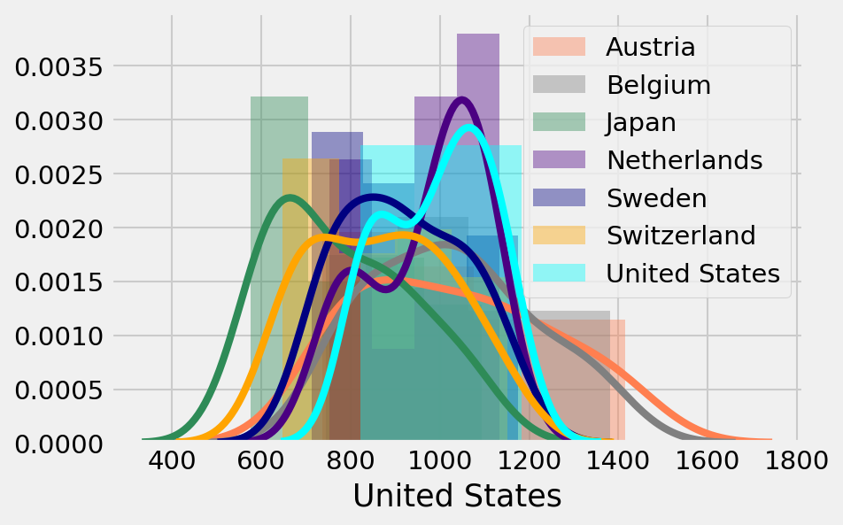
 
* Does the wealth and Size of a country indicate its Mortality Rate? Are these similar countries statistically significant?

 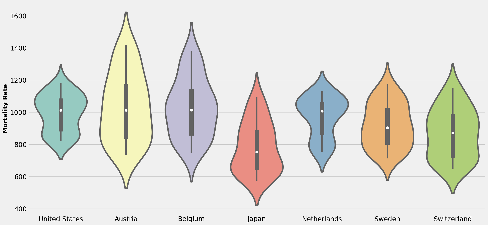

The Median for United States is similar to other countries but has a much more densely populated data points. The other countries are more spread out while the US is oriented towards the mean. That justifies the mortality rate trendline above because other countries started off with a higer rate and over time, the rate declined while United States mortality rate stayed above the Average post 1985 and since then has declined by a much smaller margin. The number of deaths in United States never had the highest ceiling but also has been further from the floor of the entire dataset. 

We can form our null hypothesis - **Countries of similar size and wealth have a statistically similar mortality rate.**

After Performing ANOVA test on the dataset, the p-value is far below 0.05 hence we reject our null hypothesis that the data set is similar. Countries of similar size and wealth do not account for a similar mortality rate and other factors have to be taken in consideration.

* What about a subset of the Country dataset? Is that statistically significant?

 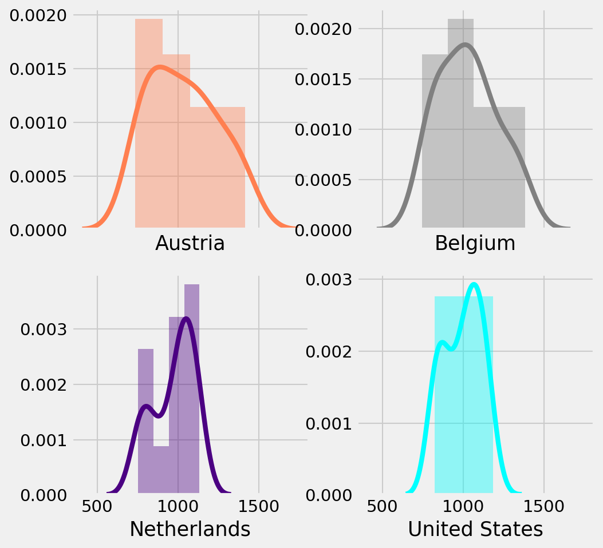

If we take a subset from the dataset above, accounting for AUstria, Netherlands and Belgium, and perform ANOVA test on the dataset, we get a p-value of 0.33. This dataset is now statistically significant. We can, for this case, accept our null hypothesis and conclude that Size and Wealth of similar countries shows a similar rate of mortality. This is a great question to think about. All four countries form a similar normal distribution and there is a strong correlation between the datasets.

How does a subset of similar countries become statistically significant but not the whole dataset. What are the external factors that make the full dataset get rejected for our null hypothesis. This is where geo-political and social demographics need to be researched further.

### Insight into Leading Causes of Death in United States

These are the leading causes of death in United States - 

Increasing Leading Causes of Death in the country - 

 
 Leading Causes versus Uninsured %
 
 We looked into the % of uninsured people in the country in the same time period and found a correlation
 

Finally, Change in Leading Causes of Death over 2008-2016 period - 

### Unemployment Rates and Age Adjusted Death Rates 
The age adjusted death rates' trends in Texas seemed to change in 2015 along with the total amounts of deats in 2015 relative to years approximate to 2015.  Since Texas has many oil and gas jobs and a major downturn in the industry began after Thanksgiving of 2014, **a hypothesis was made that age adjusted death rates for Texas increased when the unemployment rate increased.**  Unemployment data for TX was found and merged into a previous dataframe.  The leading causes of death over time was plotted with the Texas unemployment rate trend over time and overall it did not visually seem to correlate with the age adjusted death rate.  California's, New York's, and Texas' unemployment trends were then plotted with California's, New York's, and Texas' age adjusted deat rates by all causes and again, a trend could not be conslusively visualized.  In fact, during 2010, each state had its highest unemployment rates and the age adjusted death rates continued to decrease.  Texas had the lowest unemployment rates of the states compared in the dataset but also had the higest age adjuste death rates of the states in the comparison.  It is interesting that in 2015, **Texas' uneployment rate started to tick up wile California and New York's unemployment rate continued to decrease.**  Pearson's correlation coefficient was calculated to be
-0.241 Texas's age adjusted death rate and its unemployment rates.  The unemployment rates of each state seemed highly correlated as calculted with Pearson's coefficient using pearsonr from scipy.stats. It is also worth noting that in the dataset comparing TX, CA, and NY unenemployment rate with death rates, California had the lowest death rate of the three states, but also the highest unemployment.

  * What are the leading causes of Death in Texas? - 
  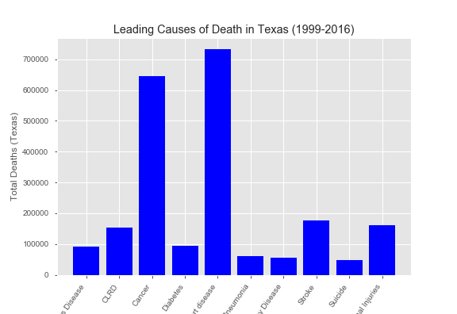
  
  * How does the three leading causes of death trend over time for Texas? -
  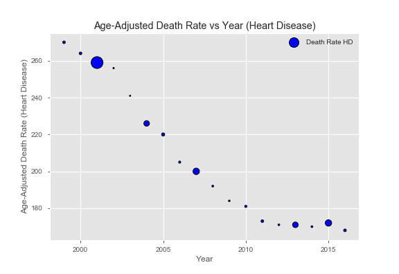
  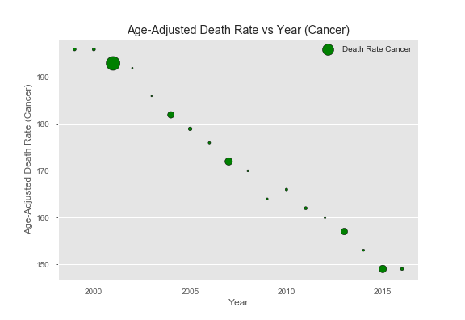
  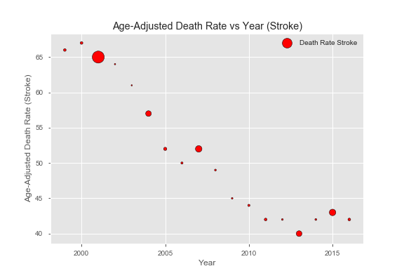
  
  2015 saw increases in age adjusted death rates for heart disease and stroke and no decrease for cancer.  Did oil and gas downturn and higher rates of  unemployment affect those rates or is there a correlation?
  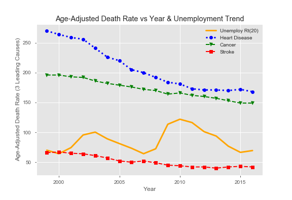
  
  * How does California's and New York's unemployment correlate to their age adjusted death rates in comparison to Texas and do the 3 states unemployment rates correlate?
  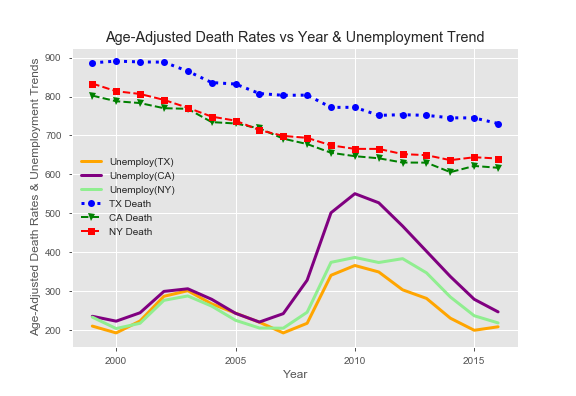
  
  
  
  
  
  
  

## Conclusion
  * Heart Diseases, Cancer and Stroke are the three leading causes of Death in United States.
  * Suicide rates and Alzheimer's Disease rates are on the rise
  * New York has the highest distribution of a leading cause for state(Heart Diseases in this case).
  * Texas had lower unemployment rates compared to California and New York, but a higher age-adjusted death rate overall.
  * For Stroke and Heart Diseases, there was a spike in Texas. We investigated if that had a correlation with the Major Oil and Gas Downturn on 2015 and consequently unemployment rates for Texas.
  * Since 1985, United States has the worst Mortality rate(per 100000 people) when compared to other countries of "similar" size and wealth.
  * We formed our null hypothesis that Countries of similar wealth and size will have a similar mortality rate. After performing ANOVA test on the dataset featuring 7 countries, the null hypothesis was rejected. However, when we take a group of 4 countries and perform the same test, the dataset is significant.
  
 ### Files Attached - 
  * Project_1.ipynb - Main Notebook. Stores, cleans up the data and analyses statewide and countrywide data.
  * Countries analysis.ipynb	- Notebook Analyses United States Data with on a global cale with OECD similar countries
  * Leading_Causes_of Death_Completed.ipynb	- Notebook cleans and analyses various factors(like insurance) affecting death rate

  
